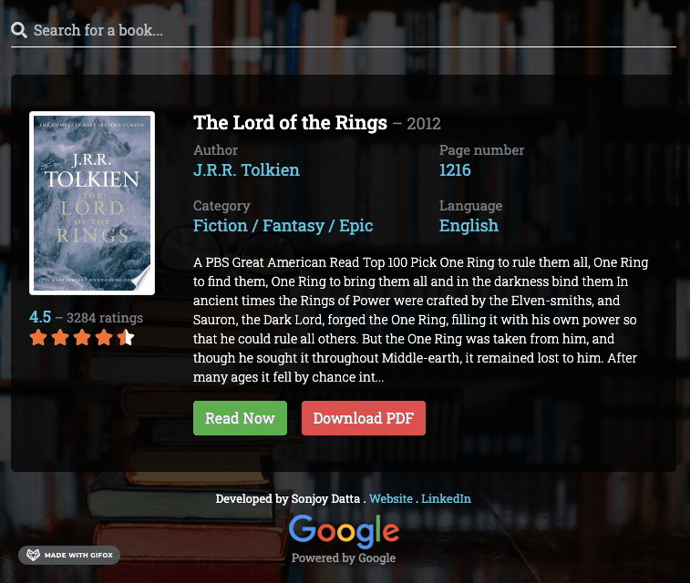

# Google Books Search

Google Books Search is a [Next.js](https://nextjs.org/) project which used the [Debounce](https://github.com/nkbt/react-debounce-input) library to get the data using the [Google Books API](https://developers.google.com/books).

## Demo

[Google Books Search - Live Demo](https://sachnaror.github.io/Search-Books-NextJS/)

## Tools

| Tool | Description |
| --- | --- |
| [Next.js](https://nextjs.org/) | To build a complete web application with React from scratch |
| [Debounce](https://github.com/nkbt/react-debounce-input) | A React component that renders an Input, Textarea or other element with debounced onChange |
| [unfetch](https://github.com/developit/unfetch) | I have used isomorphic-unfetch library, hence I need to fetch API |
| [Moment.js](https://momentjs.com/) | Validate and display the year of the book published |
| [Bootstrap](http://getbootstrap.com/) | Build responsive, mobile-first projects on the web with the world's most popular front-end component library |
| [SASS](http://sass-lang.com/) | Sass is the most mature, stable, and powerful professional grade CSS extension language in the world |
| [FontAwesome](https://fontawesome.com/) | The web's most popular icon set and toolkit |

## Browser Support

- Chrome 42+
- Firefox 39+
- Safari 10+
- Internet Explorer 11+
- Edge 14+

## Author

This is Sachin. I am a Full-Stack Developer. I am experienced in NextJs, Python (Django, FastAPI, Falcon), Bootstrap, HTML5, CSS3, SASS/LESS, Laravel, WordPress, GIT, Bitbucket, etc. Alongside this, I am also working with database architecture development.
